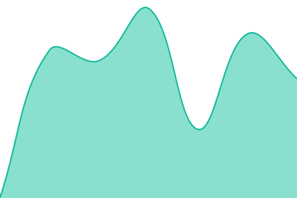
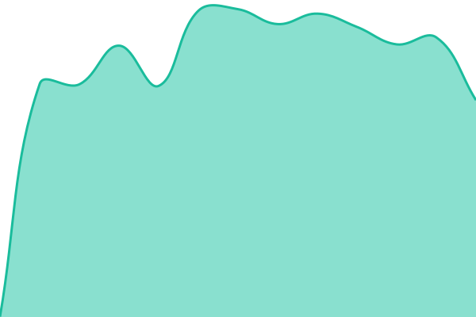
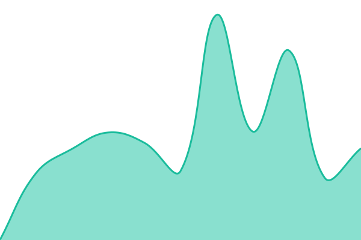
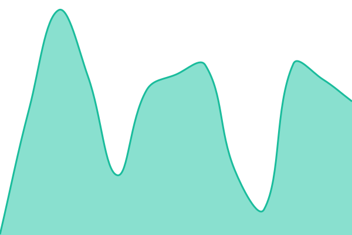
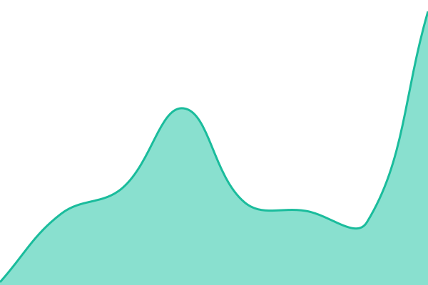

# [📈 Live Status](https://status.komestudio.com): <!--live status--> **🟧 Partial outage**

This repository contains the open-source uptime monitor and status page for [Kome Studio](https://komestudio.com), powered by [Upptime](https://github.com/upptime/upptime).

With [Upptime](https://upptime.js.org), you can get your own unlimited and free uptime monitor and status page, powered entirely by a GitHub repository. We use [Issues](https://github.com/KomeStudio/Status/issues) as incident reports, [Actions](https://github.com/KomeStudio/Status/actions) as uptime monitors, and [Pages](https://status.komestudio.com) for the status page.

<!--start: status pages-->
<!-- This summary is generated by Upptime (https://github.com/upptime/upptime) -->
<!-- Do not edit this manually, your changes will be overwritten -->
<!-- prettier-ignore -->
| URL | Status | History | Response Time | Uptime |
| --- | ------ | ------- | ------------- | ------ |
|  [Kome Studio](https://komestudio.com) | 🟩 Up | [kome-studio.yml](https://github.com/KomeStudio/Status/commits/HEAD/history/kome-studio.yml) | 

 313ms
     
 | 

<a href="https://status.komestudio.com/history/kome-studio">100.00%</a>
    

|  [Kami Machine](https://kamimachine.com) | 🟩 Up | [kami-machine.yml](https://github.com/KomeStudio/Status/commits/HEAD/history/kami-machine.yml) | 

 832ms
     
 | 

<a href="https://status.komestudio.com/history/kami-machine">100.00%</a>
    

|  [Kome Smart](https://kome.top) | 🟩 Up | [kome-smart.yml](https://github.com/KomeStudio/Status/commits/HEAD/history/kome-smart.yml) | 

 456ms
     
 | 

<a href="https://status.komestudio.com/history/kome-smart">100.00%</a>
    

|  [Github Hoangdacviet](http://hoangdacviet.github.io) | 🟩 Up | [github-hoangdacviet.yml](https://github.com/KomeStudio/Status/commits/HEAD/history/github-hoangdacviet.yml) | 

 189ms
     
 | 

<a href="https://status.komestudio.com/history/github-hoangdacviet">100.00%</a>
    

|  Secret Site | 🟥 Down | [secret-site.yml](https://github.com/KomeStudio/Status/commits/HEAD/history/secret-site.yml) | 

 0ms
     
 | 

<a href="https://status.komestudio.com/history/secret-site">98.94%</a>
    

<!--end: status pages-->

[**Visit our status website →**](https://status.komestudio.com)

## 📄 License

- Powered by: [Upptime](https://github.com/upptime/upptime)
- Code: [MIT](./LICENSE) © [Anand Chowdhary](https://anandchowdhary.com)
- Data in the `./history` directory: [Open Database License](https://opendatacommons.org/licenses/odbl/1-0/)
